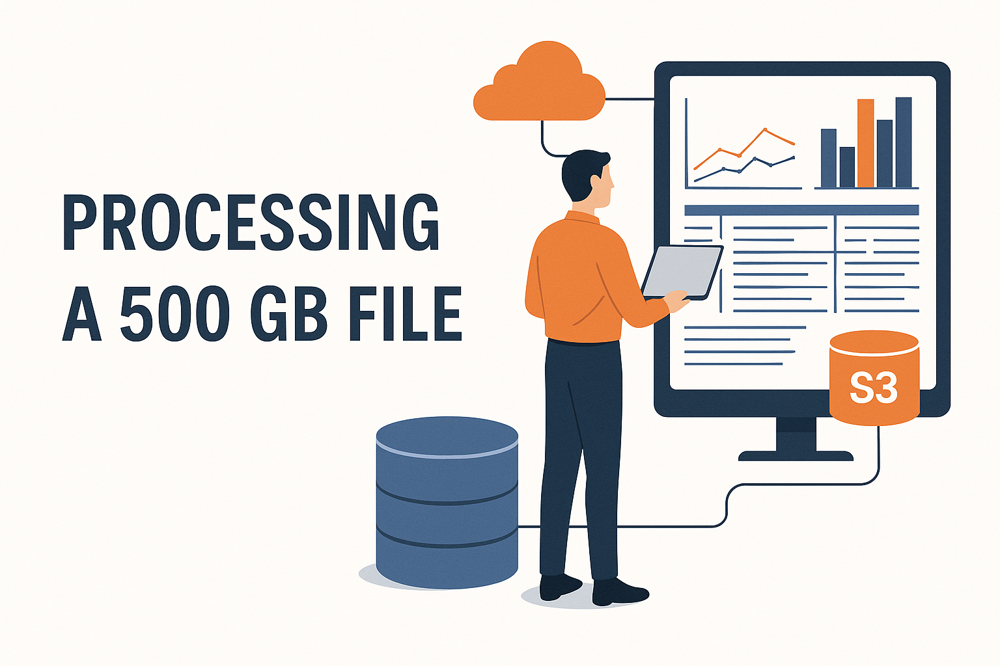
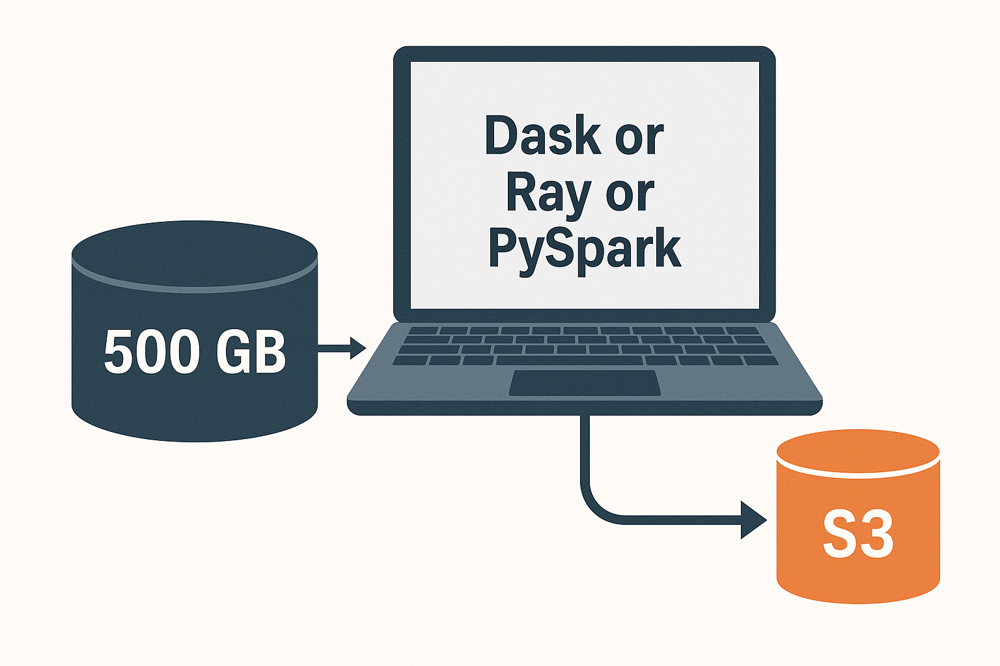

# Actividad RA2: Procesamiento de 500 GB con Recursos Limitados

   

## 1. Estructura del proyecto
```plaintext
demo_dask_500gb/
├─ requirements.txt
├─ README.md            (opcional, para ti)
├─ data/
│   └─ generar_datos.py
├─ procesar_con_dask.py
└─ config_example.yaml  (opcional, para rutas remotas)
```

## 2. requirements.txt
```plaintext
dask[complete]
pandas
numpy
fsspec
s3fs            # solo si queréis probar con S3 real
pyarrow         # para escribir/leer parquet
```

En local (sin S3) bastan dask[complete], pandas, numpy y pyarrow.

## 3. Script para generar datos de ejemplo
Esto simula el “gran fichero” (en pequeño).
Para un nivel más hardcore puedes subir N_FILAS a 10M.

## 4. Script principal con Dask

**Archivo:** `procesar_con_dask.py`
Hace tres cosas:
  * Leer el CSV “grande” con Dask en particiones (como si fueran bloques de 256 MB).
  * Calcular media y desviación típica de importe.
  * Crear una columna normalizada y guardar el resultado en un “bucket” local (output/).

**Archivo:** `data/generar_datos.py`  
Genera un CSV “tipo log / ventas” de tamaño configurable.

**Qué se puede observar aquí**

```python
dd.read_csv(..., blocksize="64MB")
# → Dask trata el fichero como muchas particiones, nunca como un solo DataFrame gigante en RAM.

media = df["importe"].mean()
# → lazy: construye el plan, no lee aún el fichero.

media.compute() / std.compute()
# → aquí se dispara el cómputo: Dask recorre todas las particiones, calcula sumas parciales, las combina, etc.

df_norm.to_parquet(...)
# → también dispara cómputo: recorre de nuevo las particiones, aplica la normalización y escribe el resultado por partes.
```

## 5. Cómo “convertirlo” en cloud (S3, Azure, etc.)
Cuando quieras enlazarlo con la parte de almacenamiento en la nube:
En vez de 

```python
RUTA_ENTRADA = "data/ventas_logs.csv"
```

podrías usar rutas como:

```python
RUTA_ENTRADA = "s3://mi-bucket/ventas/ventas_logs.csv"
RUTA_ENTRADA = "abfs://container@account.dfs.core.windows.net/ventas_logs.csv"  # (Azure)
```

Y pasar `storage_options`:

```python
df = dd.read_csv(
    "s3://mi-bucket/ventas/ventas_logs.csv",
    blocksize=BLOCKSIZE,
    storage_options={
        "key": "TU_ACCESS_KEY",
        "secret": "TU_SECRET_KEY",
    }
)
```

Igual con la salida:

```python
FICHERO_SALIDA_PARQUET = "s3://mi-bucket/resultados/ventas_normalizadas.parquet"
FICHERO_STATS_SALIDA = "s3://mi-bucket/resultados/stats_importe.csv"
```

El código de Dask es esencialmente el mismo; solo cambian las rutas y las credenciales. Eso engancha muy bien con:

- “puedo almacenar tantos datos como quiera y decidir después cómo procesarlos”
- “el sistema puede crecer añadiendo nodos / workers”.

## 6. Cómo usarlo en clase (resumen)
1. Ejecutar `python data/generar_datos.py`.
2. Verificar tamaño del CSV (que sea “grandecito”).
3. Ejecutar `python procesar_con_dask.py`.
4. Comentar:
    * qué hace blocksize,
    * qué pasa en .compute(),
    * por qué se puede escalar a varios nodos sin cambiar mucho el código.

## Instalación y Configuración

Sigue estos pasos para descargar el proyecto y preparar tu entorno de trabajo aislado.

### 1. Clonar el repositorio
```bash
git clone [https://github.com/TU_USUARIO/demo_dask_500gb.git](https://github.com/TU_USUARIO/demo_dask_500gb.git)
cd demo_dask_500gb
```

### 2. Crear y activar el entorno virtual

Es fundamental crear un entorno aislado (`env`) para no corromper tu instalación local de Python.

**En Windows:**

```bash
python -m venv env
.\env\Scripts\activate
```

**En Mac / Linux:**

```bash
python3 -m venv env
source env/bin/activate
```

> 💡 **Nota:** Sabrás que funciona si ves `(env)` al inicio de tu terminal.

### 3. Instalar dependencias

```bash
pip install -r requirements.txt
```
